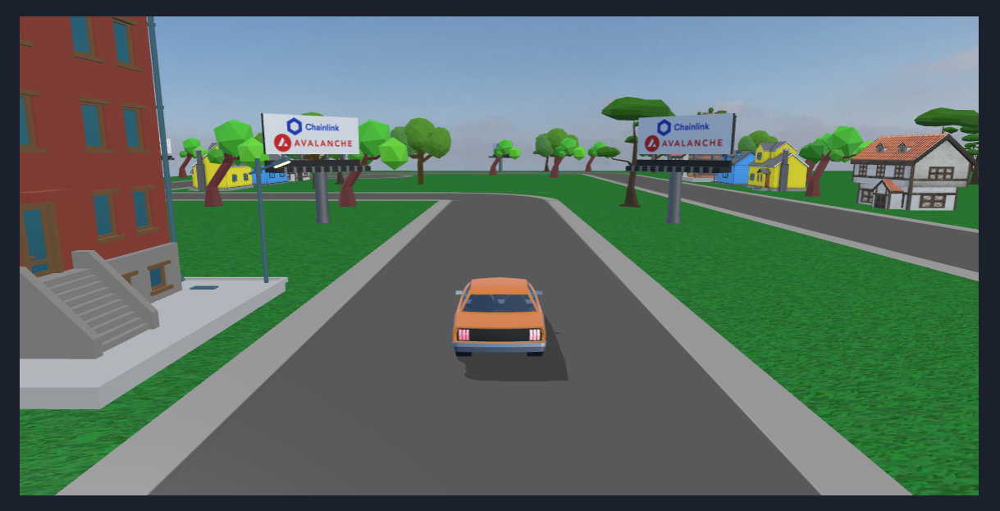

<div align="center">

<h1><strong> Fury Racing | Frontend </strong></h1>
<br/>

<br>

</div>
</br>

## Table of Contents

- [Table of Contents](#table-of-contents)
- [Description:](#description)
- [Built With:](#built-with)
- [BabylonJS implementation](#babylonjs-implementation)
  - [Successfully importing third-party assets](#successfully-importing-third-party-assets)
  - [Programming the race track layout](#programming-the-race-track-layout)
- [Installation](#installation)
  - [Make sure you have the following ready:](#make-sure-you-have-the-following-ready)
  - [Clone the repo:](#clone-the-repo)
  - [Install all package dependencies:](#install-all-package-dependencies)
  - [Add your API keys in the .env file:](#add-your-api-keys-in-the-env-file)
  - [To start Fury Racing:](#to-start-fury-racing)
- [Credits](#credits)
  - [Asset attributions:](#asset-attributions)
  - [Music attributions:](#music-attributions)

## Description:

The front end of Fury Racing has been built to make the interaction with the smart contracts as smooth as possible. Only one transaction is required to play a game, even as a new player. All racing modes are accessible directly from the front end.

This comes as a PWA (Progressive Web App) with a responsive design, allowing it to be played on any device, from desktop to mobile to be accessible to as many users as possible. And because it is a PWA, you can even install it on your device in one click!

Dark mode, sound, and Fullscreen are also available to enhance the user experience and make it feel like a real game.

And the best part... To make it even cooler, we have integrated some beautiful 3D animations with BabylonJS to make the game more immersive and fun!

<div align="center">
  
</div>

## Built With:

- [![nextjs]][nextjs-url]
- [![typescript]][typescript-url]
- [![babylonjs]][babylonjs-url]
- [![chakraui]][chakraui-url]
- [![viem]][viem-url]
- [![wagmi]][wagmi-url]
- [![Rainbowkit]][rainbowkit-url]
- [![prettier]][prettier-url]
- [![ESLint]][eslint-url]

## BabylonJS implementation

The following features of the BabylonJS engine were used:

- Loading all assets (meshes, textures) in batch, with a loading screen during processing, with `AssetsManager`.
- Loading `glTF` meshes specifically with the built-in BabylonJS loader.
- Using a `FollowCamera` to automatically follow the vehicle as it moves.
- Using `Animation` and `AnimationGroup` classes to animate the vehicle's movement.
- Generating shadows for the vehicle with `ShadowGenerator` and a `DirectionalLight`.
- Generating a skybox with the `Scene.createDefaultSkybox()` helper function.
- Generating rain particles with a `ParticleSystem`.
- Generating fog via the `Scene.fogMode` property.

#### Successfully importing third-party assets

All 3D assets were found on [SketchFab](https://sketchfab.com) (credits listed further down this document).
However, not all assets were perfectly centered on the origin `(0, 0, 0)`.
Furthermore, many of the assets varied greatly in size.

As such, an array of metadata constants was created to specify the offset and scale of each asset.
The meshes are therefore correspondingly offset and re-scaled during initialization.



#### Programming the race track layout

In order to quickly implement a simple, flexible race track builder system, we opted to allow the coding of tracks using plain ASCII.
This allows us to embed the layout of race tracks directly in the code, and makes it easy to visualize the end result in advance, without any third-party tools.
Furthermore, this greatly facilitates the creation/addition of new tracks, if desired.

By going with a grid/tile-based approach, it also simplifies the automation of the vehicle animation.
The engine simply gets the vehicle to move from the current tile to the next tile in the appropriate direction through a looping process.

We ended up choosing Monaco as the sole race track of the first release. You can see its ASCII equivalent below:

```
0000000000V000000˻V00V
000V00000000VV┌───┐0V0
0V0000V0000V00│┴┴┴│┌┐V
0000V00000000V│VV0└┘│0
0V0V╦╦0╦0╦╦0˻V│0V000│0
00┌───────────┘0000V│˹
V┌┘00VV00V00˹V0000VV│V
˼│V┌───┐0┌──────────┘V
0│╣│V┴V└─┘0˺0┴V┴┴╩┴0V0
├│╣│V00V╩V0000V0V00000
├│V└┐000000V000000V0V0
V│V╠│┤0000000V00VV0000
├│V╠│˹00V000000V000000
├│˻┌┘0V0000V0000000000
├│0│V00V0V000000000000
V│0│┤V0V00000V0000000V
V└┐└─┐00000000000000V0
0V└──┘ 0V00000V0000000
00VVVV00000000000V0000
```

With the corresponding character legend:

- `0`: Blank (grass) tile.
- `V`: Tree (vegetation) tile.
- `─`, `│`, `┌`, `┐`, `└` and `┘`: Road tiles.
- `├`, `┤`, `┴` and `┬`: House tiles, each representing a particular orientation.
- `╠`, `╣`, `╩` and `╦`: Building tiles, each representing a particular orientation.
- `˼`, `˻`, `˹` and `˺`: Billboards, each representing a particular orientation.

## Installation

### Make sure you have the following ready:

- [node.js](https://nodejs.org/) installed (developed on LTS v18)
- [typescript](https://www.typescriptlang.org/) installed (developed on v5.3.3)
- [bun](https://bun.sh/) or [pnpm](https://pnpm.io/) or [yarn](https://yarnpkg.com/) or [npm](https://www.npmjs.com/) installed
- [MetaMask](https://metamask.io/) (or any web3 compatible wallet) installed in your browser

### Clone the repo:

Once your config is ready, create a new repo, open your favorite code editor, and clone the repo with the following cmd:

```bash
git clone https://github.com/Pedrojok01/fury-racing.git .
```

### Install all package dependencies:

Depending on your favorite package manager, run one of the following commands in your terminal to install all the dependencies needed for the project:

```bash
bun install
# or
pnpm install
# or
yarn install
# or
npm install
```

### Add your API keys in the .env file:

Remove the `.example` from the `.env.example` file name at the root of the project and add your API keys inside. The WalletConnect project ID is now required since the v2 update. You can create one easily on the [WalletConnect dashboard](https://cloud.walletconnect.com/).

And for the weather API key, you can get one for free on [www.weatherapi.com](sign up at https://www.weatherapi.com/.).

```js
NEXT_PUBLIC_WALLETCONNECT_PROJECT_ID = "Project ID needed for WalletConnect v2 here";

WEATHER_API_KEY = "Your OpenWeatherMap API key here";
```

### To start Fury Racing:

First, run the development server:

```bash
bun dev
# or
pnpm dev
# or
yarn dev
# or
npm run dev
```

Open [http://localhost:3000](http://localhost:3000) with your browser to see the result.

## Credits

### Asset attributions:

This work is based on:

- ["Low poly Ad Billboard"](https://sketchfab.com/3d-models/low-poly-ad-billboard-864b8ce5d520478481198d1face5a7e5) by [Anthony Yanez](https://sketchfab.com/paulyanez) licensed under [CC-BY-4.0](http://creativecommons.org/licenses/by/4.0/)
- ["Modern building 03"](https://sketchfab.com/3d-models/modern-building-03-254942864da94533a4e740a9c400f7a1) by [burunduk](https://sketchfab.com/burunduk) licensed under [CC-BY-4.0](http://creativecommons.org/licenses/by/4.0/)
- ["Modern building 02"](https://sketchfab.com/3d-models/modern-building-02-3044b2aa3f1e4218a842e63815a48452) by [burunduk](https://sketchfab.com/burunduk) licensed under [CC-BY-4.0](http://creativecommons.org/licenses/by/4.0/)
- ["Modern building 05"](https://sketchfab.com/3d-models/modern-building-05-7fc1d3bd4bde4be7ab4eee80771fbef1) by [burunduk](https://sketchfab.com/burunduk) licensed under [CC-BY-4.0](http://creativecommons.org/licenses/by/4.0/)
- ["Classic Muscle car"](https://sketchfab.com/3d-models/classic-muscle-car-641efc889e5f4543bae51d0922e6f4b3) by [Lexyc16](https://sketchfab.com/Lexyc16) licensed under [CC-BY-4.0](http://creativecommons.org/licenses/by/4.0/)
- ["Toyota Corolla AE86 Trueno"](https://sketchfab.com/3d-models/toyota-corolla-ae86-trueno-fe02fba6302e450ea8424591493341ea) by [Lexyc16](https://sketchfab.com/Lexyc16) licensed under [CC-BY-4.0](http://creativecommons.org/licenses/by/4.0/)
- ["Low Poly Car"](https://sketchfab.com/3d-models/low-poly-car-93971323324243468f24d7da9d18f617) by [Straight Design](https://sketchfab.com/creativemango) licensed under [CC-BY-SA-4.0](http://creativecommons.org/licenses/by-sa/4.0/)
- ["Low poly house"](https://sketchfab.com/3d-models/low-poly-house-796232a307d24b6881f4f42476058701) by [its_sagar_bro](https://sketchfab.com/its_sagar_bro) licensed under [CC-BY-4.0](http://creativecommons.org/licenses/by/4.0/)
- ["Low poly house"](https://sketchfab.com/3d-models/low-poly-house-2596e4c92af848b8a830f6c307e93a45) by [its_sagar_bro](https://sketchfab.com/its_sagar_bro) licensed under [CC-BY-4.0](http://creativecommons.org/licenses/by/4.0/)
- ["low poly building"](https://sketchfab.com/3d-models/low-poly-building-386b478c0d2841b288c7342beca28892) by [GreyHorn102](https://sketchfab.com/GreyHorn102) licensed under [CC-BY-4.0](http://creativecommons.org/licenses/by/4.0/)
- ["Low Poly Tree 2"](https://sketchfab.com/3d-models/low-poly-tree-2-73eb8c73bd6c4a8db4e02dbb6bfcffcf) by [Render Zing](https://sketchfab.com/RenderZing) licensed under [CC-BY-4.0](http://creativecommons.org/licenses/by/4.0/)
- ["Leafy Tree - Low poly"](https://sketchfab.com/3d-models/leafy-tree-low-poly-6db96be0ea694f558836e662c595788a) by [lightguard](https://sketchfab.com/lightguard) licensed under [CC-BY-4.0](http://creativecommons.org/licenses/by/4.0/)
- ["Low-poly Tree"](https://sketchfab.com/3d-models/low-poly-tree-c452f70f0ffb4dd4ab257348ff44e367) by [ALostEggroll](https://sketchfab.com/ALostEggroll) licensed under [CC-BY-4.0](http://creativecommons.org/licenses/by/4.0/)
- ["Abstract green grass seamless texture"](https://www.vecteezy.com/vector-art/5473024-abstract-green-grass-seamless-texture) by [Maksim Borzdov](https://www.vecteezy.com/members/makstorm10000510543)
- [Overcast Soil (Pure Sky)](https://polyhaven.com/a/overcast_soil_puresky) by [Sergej Majboroda](https://polyhaven.com/all?a=Sergej%20Majboroda), [Jarod Guest](https://polyhaven.com/all?a=Jarod%20Guest) licensed under [CC0](https://creativecommons.org/publicdomain/zero/1.0/)
- [Farm Field (Pure Sky)](https://polyhaven.com/a/farm_field_puresky) by [Dimitrios Savva](https://polyhaven.com/all?a=Dimitrios%20Savva), [Jarod Guest](https://polyhaven.com/all?a=Jarod%20Guest) licensed under [CC0](https://creativecommons.org/publicdomain/zero/1.0/)
- [Drakensberg Solitary Mountain (Pure Sky)](https://polyhaven.com/a/drakensberg_solitary_mountain_puresky) by [Dimitrios Savva](https://polyhaven.com/all?a=Dimitrios%20Savva), [Jarod Guest](https://polyhaven.com/all?a=Jarod%20Guest) licensed under [CC0](https://creativecommons.org/publicdomain/zero/1.0/)
- [The colour of the sky from Gaia’s Early Data Release 3](https://www.esa.int/ESA_Multimedia/Images/2020/12/The_colour_of_the_sky_from_Gaia_s_Early_Data_Release_32) from the [European Space Agency](https://www.esa.int/) licensed under [CC BY-SA 3.0 IGO](https://creativecommons.org/licenses/by-sa/3.0/igo/)

### Music attributions:

The music in the game is free for use under the [Pixabay Content License](https://pixabay.com/fr/service/license-summary/).

- <i>Gym Phonk</i> by **dopestuff**: https://pixabay.com/music/beats-gym-phonk-187854/
- <i>Night Phonk</i> by **Artiss22**: https://pixabay.com/music/upbeat-night-phonk-203960/
- <i>The Final Race</i> by **Audiorezout**: https://pixabay.com/music/adventure-the-final-race-epic-sport-action-trailer-cinematic-music-198690/

<br></br>

<div align="center">
<h2>🎉 Thank you Chainlink for this amazing hackathon! 🎉</h2>
<h3>⭐️ ... and don't forget to leave a star if you like it! ⭐️</h3>
</div>

<br>

<p align="right">(<a href="#top">back to top</a>)</p>

<!-- MARKDOWN LINKS & IMAGES -->

[nextjs]: https://img.shields.io/badge/Next.js_v15.3.1-000000?style=for-the-badge&logo=next.js&logoColor=FFFFFF
[nextjs-url]: https://nextjs.org/
[typescript]: https://img.shields.io/badge/typescript_v5.8.3-375BD2?style=for-the-badge&logo=typescript&logoColor=61DAFB
[typescript-url]: https://www.typescriptlang.org/
[babylonjs]: https://img.shields.io/badge/Babylon.js-e0684b?style=for-the-badge&logo=data:image/png;base64,iVBORw0KGgoAAAANSUhEUgAAADIAAAAyCAYAAAAeP4ixAAAAAXNSR0IArs4c6QAAAARnQU1BAACxjwv8YQUAAAAJcEhZcwAADsMAAA7DAcdvqGQAAAbISURBVGhD7Zl5bBRVHMe/s3d3e+zSgxYorQgtKBBBASmoyGEEUREUNGBAufkDE4wSo0HlDyRRI38QgRZEwLsasWKj2ASJHFYlICpHKb22rXS73d3ufczO+GZ4lQB7zO7OKho/yaZ9392dfd95v/d+v/eG4Qn4D6Cgf//1/G9EKpzXDT7gp630kb45woXhOvINHDX7wKg1MD2yBIZxU8gvMvQD8pIWI/7zp2GrrkSoo4Uql9HeVA7T/JXQlpZRRT5kNcJaL8H+2S54Tx2nSgTIiGROmArj3KegzDJSMXVkmSOc3wfH/j3ofHV1bBMEhT4TGjIiSkMWVeQhtRHhObjrD4kmwr02KkaGUSqReddMGGcvhEJmEwJJGwk0nYW9ugqBlgaqREc3Ygz6PbYc6qLBVJGfhI2E7VbY978Lz4+HSSv2V1UFA2CatxT60ROoIhGhSwmubpKN8MEAnHWfo/ebavH/WCh0emTfPx/Z0+eQkFJRNT48G4Lr0JfiK3vGXGTePVPy9+MbIW97Tx4lq9E7YG0WKkZBWJHunAbjnMVQZpuoKA3f6XrYPt0JtvsPqgDqwmKYSEhm3DKWKtGJaSRobiLzoBL+C79RJTraISPQb/4KaEqGUUUaoc42YoD8xtlTVLmejFHjYXp0GdQkVKMR1Yi7qQltm56DQR07jJSmPJjmkKw9/h7SSjxru48eFOcc53ZSJRIM3CEdhm7eDm1eLtWuwJEqImoeCXm86DQH0GlVI8SpqXoFRqNFzqzHMfCVHcQEKT2SMCGQOek+DNxYhexpD0ecD4GwGu1dKvxh9iFM8lUkhLGImxA9zhBa21hYnRpwjJL0l4F+7GQM2LANxgcXiYZSRZFhIKGzHEUvbUXGyDtELQwVLA4N2tpC8HlCohYVElOSMjvP8bBbg2g1M1DPW4W8Zeuhyi2g78qHunAQ8te8DNWsJWhp49FrC4qdlEJCJQobJCPD8mhuPAOPx0XV6LBeLxp370HLx9XggqRTcfCRkr+TFJouBRl9NkxVaSRVa/n9XrQ2nUN7WyNCEXKKMIKdB+twfOlKtHxUjcZ39uD48tWwHD0mBDT91BWEa3RdaoelqwNsKL7hSCRlpA9nrx2NZGkWOsBxnKg5zpzFT8+sw5k3tyBgs4uagO9SF05v3IQT61+Eu/lyeS+sNrYeCxmFVvh9HlFLlpSMCPDEgNXSicaGX3FmRyV+Xvc8nA0X6LvXY//lNOrXrMWFDz9Ch7kZLqdgVuJEiEHKRvoQQsJ+7lzE0LkWwbz93HlxRORCNiP/JMKtS7sRhVIhvtKLhISYLAxJnDkmFUpLGJQUM8jKIVk7wdI8EdJiRG9QYXCxAgUmFkohRyvCKMxlUTxICZ1eelmfCLIaUWuVKBqgwsD+LDSq6yeyTk3MFIbRv0gNlVreeyjr1XJmToF+WLztLI+c0cOR+8A02pYHWY2E+xXA9+CTCM58HHxOP6pegckvArNgFfhHlgDG68vxVEjLHAndVA7fE2sQmjgdEKpjUt0yM+aBX/Is+AQ3XlJJixEBXqFEcMwk+BauBZa/AH5MxY21ajm/qkO4u4e24sPrDWSWZ9BWfALmDvQcOEhb0knYiP98IyxvvA3XgW/B++U7ZQ+73LC8V02212/B13T1mbEUkgotPszB9d0xWDZvha/+JBGSL/r4cBiOusNo2fAaeo/8kPS1ohrJLClBfsVE2opM2O2BvboG1i1VCDWbqSod729n0bbxdXR/WgPOF310hSqhaMY0aPPzqXI1SrLXj3uuZTt5Cg07dv61h4iF/raRyJ49HQpjDlUud0J/zVlvqMuC7k++gOd3Ui3HIWfEcJSvXoHs8tiPIiSdNArD31H7NS7ufR8hZ6xjG3JBtQpZ906GYUoFGI36KiOc1wdb7bdwHDoiXjMWurw8DH16MQqnSns4JMlIH6zbjYv7PkD7gVrwLEvVyKjIqGTPnoGM226FXp8J59EfYf2iVgzHWCi1WgyeNwelC+ZDqZN+QpOQkT48ZjMatlWi5wSZ6HHQlpKShZgOtHdSJQrkrhdMqkDZiqXQ9U/8hCYpI31Y639CQ+VOeNs7qJIcWTcPQRmZB6ZRI6mSOCkZEeDI3Tbvr0HzBx+D9SR2gKAxGnHz4kUYcP99YBSpFRkpG+kj6HDg4u694jGQsCePBaNSofih2Riy6AmoDCTzy4BsRvpwNV7E+e1VcPwa+QQ/b/w4DCPzwFA8iCryILuRProOf48Lu3bDT3KGgKG4GGUrlyF33O1iW27SZkSACwTR+tnnUGboxFASHoimi7Qa+TtJbam4gfjfyI0F8CdGHMmCnzqjtwAAAABJRU5ErkJggg==
[babylonjs-url]: https://www.babylonjs.com/
[chakraui]: https://img.shields.io/badge/ChakraUI-purple?style=for-the-badge&logo=ChakraUI&logoColor=319795
[chakraui-url]: https://chakra-ui.com/
[wagmi]: https://img.shields.io/badge/Wagmi-35324a?style=for-the-badge&logo=data:image/png;base64,iVBORw0KGgoAAAANSUhEUgAAAGQAAABkCAYAAABw4pVUAAAAAXNSR0IArs4c6QAAAARnQU1BAACxjwv8YQUAAAAJcEhZcwAADsMAAA7DAcdvqGQAAAW5SURBVHhe7ZvbT1RHHMe/LHcQZLnsNoBsBFyh0JJWU6SJFVOflNXEBpNaaNFS47W3WLQPDdbHmoiIWltp7T9QAVtti2iLb7U+aMCG0Ad88KFULgEakHvP7zAYoex6ds/u5gf+PsmGmVmyhzmfmd/Mcn4TYrVapyGwwaJ+CkwQIcwQIcwQIcwQIcwQIcwQIcwQIcwQIcwQIcwQIcwQIcwQIcwQIcwQIcwQIcwQIcwQIcwQIcwQIcwQIcwQIcwQIcwQIcwQIcwQIcwQIcwQIcwQIcwQIcwIjY6OPqbKPhMeHg6bzYa0tHRMTU3i0aNH6h3/YrUmwuHIQExsLEa1a0xOTqp3/EdERARsdjscGRkYHR3VX8HE9PmQ3Nzn8W5lJVauzERMTAz6+/pw+XITmpoaMTIyon7LHPHx8SgrK8f69a8hwWrF2NgY7t69g+8ufouuri5MT/vniEvhunXYVbEb9ufsiNWkP3jwAJcufY9rzc1BE2NKiM1mx9mz57Bm7VqEhYXpbXRz/h0awvHjn+udGR8f19t9hUbsnj17sXffPsTFxSEkJERvJym3b/+Bgwf2o6enR28zQ1FREaqPHUdOTg4slplIPjU1hcHBQVRXf4amxka9HmhMrSGlpaV4pbDwsQyCblicNqL3HziApKQk1eo7KVooLN2xQ58lszIIElVU9Cq2b38DoaGhqtU3tLANl2urNttzH8sgqJyQkIDDh6u0Poar1sBiSsiGDcVzbtKTUAh74cWCOR30hdVOp/ZZK1VtLnTt1zdtMn2N5csT8NLLa9z2ZcWKFSguLla1wGKqJ9HamuGJ2Ke8b4SkpBRVWphVq5ymhdAMp3DoCQplwcBcT4KC5yUuOTnZ7cj2J5GRkaoUWBaBkMDfbE4s+hmy1JAZwoxFIOTZQkIWMyRkMUNmCDNkhjBDFnVmSMhihoQsZsgMYYbMEGbIos4MCVnMCKiQlBSb6WcVlGHyLBFQIc7VTtNCCgoKVMk9aWlpquQb0THR+mNaDgRUSEmJCzk5uarmPVlZWdi8eYuquaey8j09BckX6Engzjd3+jxw6PGx1WpFZmYWnE6n9jdnw26367lqvhBQIZTbVHu6Di6XC9bERNX6dKhDW7dtw8maU4Zu9Ftl5ag6chSZmsAnM2A8QTeMZt+HH32MsvK3Vat3kMwtJSWoOVWLK1euouX6r/jp519Q/81F7N23X5913oo2lZf1w49XDYWU3t5edHZ24v79Lj2RbspNYpvFEqLnejkcDmRnZ+uZikahPK2Ojg7tWj34S7vWmId8MEopSk1NRUaGQ89oMTKa607X4sSJL1RthkOHPsA7uypg09bK+VD2ZmvrbzhS9Qn6tD4bJShCZpmYmNDTP91lGtJoohFuNs+Ksgw9ZTPS59N1vBm984Vs3LgRdWfO6XLdQf09U3catbWnDKe9BnXbSzeBpnlUVNSCL3rPrAzC0zXoRTPC7GaDwuSyZctUbWGovxW7dhsOo0RQhSwVKLEuLy/PUD4YZT56I1+EGITWqFlos2KxmJ/JC2FKSH9/vyotfdra2lQJ6O7+G0NDQ6rmX0wJaWm5pkpLm4cPH+LWrd9VDfoC3dTYYGih/vPePa+y5s0JudaM9vZ2VVua0BmXT48ewfDwsGqZoaHhkqEIUVNzUt9tGcX0gZ38/HwcPPg+8rSfoaHkd/4CRh+/+Npo1/xPdzfOn/8SN25cX/CcC/0n4fxXF7Rv6ZlzvsvQlntgYAD1F75Gff2F/8n0hGkhs6Smpnm1veMOHc2jg0BPO56Xnp6uny2h3dQsk1qIunvnDm7ebPX6FJnfhAj+Qba9zBAhzBAhzBAhzBAhzBAhzBAhzBAhzBAhzBAhzBAhzBAhzBAhzBAhzBAhzBAhzBAhzBAhzBAhzBAhzBAhzBAhzBAhzBAhzBAhzBAhzBAhzBAhzBAhzBAhzBAhzBAhrAD+A51VcvKQFC4uAAAAAElFTkSuQmCC
[wagmi-url]: https://wagmi.sh/
[Rainbowkit]: https://img.shields.io/badge/Rainbowkit-006600?style=for-the-badge&logo=data:image/svg+xml;base64,PHN2ZyB4bWxucz0iaHR0cDovL3d3dy53My5vcmcvMjAwMC9zdmciIGZpbGw9Im5vbmUiIHZpZXdCb3g9IjAgMCAxMjAgMTIwIj48cGF0aCBmaWxsPSJ1cmwoI2EpIiBkPSJNMCAwaDEyMHYxMjBIMHoiLz48cGF0aCBmaWxsPSJ1cmwoI2IpIiBkPSJNMjAgMzhoNmMzMSAwIDU2IDI1IDU2IDU2djZoMTJjMyAwIDYtMyA2LTYgMC00MS0zMy03NC03NC03NC0zIDAtNiAzLTYgNnYxMloiLz48cGF0aCBmaWxsPSJ1cmwoI2MpIiBkPSJNODQgOTRoMTZjMCAzLTMgNi02IDZIODR2LTZaIi8+PHBhdGggZmlsbD0idXJsKCNkKSIgZD0iTTI2IDIwdjE2aC02VjI2YzAtMyAzLTYgNi02WiIvPjxwYXRoIGZpbGw9InVybCgjZSkiIGQ9Ik0yMCAzNmg2YzMyIDAgNTggMjYgNTggNTh2Nkg2NnYtNmMwLTIyLTE4LTQwLTQwLTQwaC02VjM2WiIvPjxwYXRoIGZpbGw9InVybCgjZikiIGQ9Ik02OCA5NGgxNnY2SDY4di02WiIvPjxwYXRoIGZpbGw9InVybCgjZykiIGQ9Ik0yMCA1MlYzNmg2djE2aC02WiIvPjxwYXRoIGZpbGw9InVybCgjaCkiIGQ9Ik0yMCA2MmMwIDMgMyA2IDYgNiAxNCAwIDI2IDEyIDI2IDI2IDAgMyAzIDYgNiA2aDEwdi02YzAtMjMtMTktNDItNDItNDJoLTZ2MTBaIi8+PHBhdGggZmlsbD0idXJsKCNpKSIgZD0iTTUyIDk0aDE2djZINThjLTMgMC02LTMtNi02WiIvPjxwYXRoIGZpbGw9InVybCgjaikiIGQ9Ik0yNiA2OGMtMyAwLTYtMy02LTZWNTJoNnYxNloiLz48ZGVmcz48cmFkaWFsR3JhZGllbnQgaWQ9ImIiIGN4PSIwIiBjeT0iMCIgcj0iMSIgZ3JhZGllbnRUcmFuc2Zvcm09Im1hdHJpeCgwIC03NCA3NCAwIDI2IDk0KSIgZ3JhZGllbnRVbml0cz0idXNlclNwYWNlT25Vc2UiPjxzdG9wIG9mZnNldD0iLjgiIHN0b3AtY29sb3I9IiNGRjQwMDAiLz48c3RvcCBvZmZzZXQ9IjEiIHN0b3AtY29sb3I9IiM4NzU0QzkiLz48L3JhZGlhbEdyYWRpZW50PjxyYWRpYWxHcmFkaWVudCBpZD0iZSIgY3g9IjAiIGN5PSIwIiByPSIxIiBncmFkaWVudFRyYW5zZm9ybT0ibWF0cml4KDAgLTU4IDU4IDAgMjYgOTQpIiBncmFkaWVudFVuaXRzPSJ1c2VyU3BhY2VPblVzZSI+PHN0b3Agb2Zmc2V0PSIuNyIgc3RvcC1jb2xvcj0iI0ZGRjcwMCIvPjxzdG9wIG9mZnNldD0iMSIgc3RvcC1jb2xvcj0iI0ZGOTkwMSIvPjwvcmFkaWFsR3JhZGllbnQ+PHJhZGlhbEdyYWRpZW50IGlkPSJoIiBjeD0iMCIgY3k9IjAiIHI9IjEiIGdyYWRpZW50VHJhbnNmb3JtPSJtYXRyaXgoMCAtNDIgNDIgMCAyNiA5NCkiIGdyYWRpZW50VW5pdHM9InVzZXJTcGFjZU9uVXNlIj48c3RvcCBvZmZzZXQ9Ii42IiBzdG9wLWNvbG9yPSIjMEFGIi8+PHN0b3Agb2Zmc2V0PSIxIiBzdG9wLWNvbG9yPSIjMDFEQTQwIi8+PC9yYWRpYWxHcmFkaWVudD48cmFkaWFsR3JhZGllbnQgaWQ9ImkiIGN4PSIwIiBjeT0iMCIgcj0iMSIgZ3JhZGllbnRUcmFuc2Zvcm09Im1hdHJpeCgxNyAwIDAgNDUuMzMzMyA1MSA5NykiIGdyYWRpZW50VW5pdHM9InVzZXJTcGFjZU9uVXNlIj48c3RvcCBzdG9wLWNvbG9yPSIjMEFGIi8+PHN0b3Agb2Zmc2V0PSIxIiBzdG9wLWNvbG9yPSIjMDFEQTQwIi8+PC9yYWRpYWxHcmFkaWVudD48cmFkaWFsR3JhZGllbnQgaWQ9ImoiIGN4PSIwIiBjeT0iMCIgcj0iMSIgZ3JhZGllbnRUcmFuc2Zvcm09Im1hdHJpeCgwIC0xNyAzMjIuMzcgMCAyMyA2OSkiIGdyYWRpZW50VW5pdHM9InVzZXJTcGFjZU9uVXNlIj48c3RvcCBzdG9wLWNvbG9yPSIjMEFGIi8+PHN0b3Agb2Zmc2V0PSIxIiBzdG9wLWNvbG9yPSIjMDFEQTQwIi8+PC9yYWRpYWxHcmFkaWVudD48bGluZWFyR3JhZGllbnQgaWQ9ImEiIHgxPSI2MCIgeDI9IjYwIiB5MT0iMCIgeTI9IjEyMCIgZ3JhZGllbnRVbml0cz0idXNlclNwYWNlT25Vc2UiPjxzdG9wIHN0b3AtY29sb3I9IiMxNzQyOTkiLz48c3RvcCBvZmZzZXQ9IjEiIHN0b3AtY29sb3I9IiMwMDFFNTkiLz48L2xpbmVhckdyYWRpZW50PjxsaW5lYXJHcmFkaWVudCBpZD0iYyIgeDE9IjgzIiB4Mj0iMTAwIiB5MT0iOTciIHkyPSI5NyIgZ3JhZGllbnRVbml0cz0idXNlclNwYWNlT25Vc2UiPjxzdG9wIHN0b3AtY29sb3I9IiNGRjQwMDAiLz48c3RvcCBvZmZzZXQ9IjEiIHN0b3AtY29sb3I9IiM4NzU0QzkiLz48L2xpbmVhckdyYWRpZW50PjxsaW5lYXJHcmFkaWVudCBpZD0iZCIgeDE9IjIzIiB4Mj0iMjMiIHkxPSIyMCIgeTI9IjM3IiBncmFkaWVudFVuaXRzPSJ1c2VyU3BhY2VPblVzZSI+PHN0b3Agc3RvcC1jb2xvcj0iIzg3NTRDOSIvPjxzdG9wIG9mZnNldD0iMSIgc3RvcC1jb2xvcj0iI0ZGNDAwMCIvPjwvbGluZWFyR3JhZGllbnQ+PGxpbmVhckdyYWRpZW50IGlkPSJmIiB4MT0iNjgiIHgyPSI4NCIgeTE9Ijk3IiB5Mj0iOTciIGdyYWRpZW50VW5pdHM9InVzZXJTcGFjZU9uVXNlIj48c3RvcCBzdG9wLWNvbG9yPSIjRkZGNzAwIi8+PHN0b3Agb2Zmc2V0PSIxIiBzdG9wLWNvbG9yPSIjRkY5OTAxIi8+PC9saW5lYXJHcmFkaWVudD48bGluZWFyR3JhZGllbnQgaWQ9ImciIHgxPSIyMyIgeDI9IjIzIiB5MT0iNTIiIHkyPSIzNiIgZ3JhZGllbnRVbml0cz0idXNlclNwYWNlT25Vc2UiPjxzdG9wIHN0b3AtY29sb3I9IiNGRkY3MDAiLz48c3RvcCBvZmZzZXQ9IjEiIHN0b3AtY29sb3I9IiNGRjk5MDEiLz48L2xpbmVhckdyYWRpZW50PjwvZGVmcz48L3N2Zz4=&logoColor=4FC08D
[rainbowkit-url]: https://github.com/rainbow-me/rainbowkit#readme
[viem]: https://img.shields.io/badge/Viem-ffc517?style=for-the-badge&logo=data:image/jpeg;base64,/9j/4AAQSkZJRgABAQEASABIAAD/2wBDAAEBAQEBAQEBAQEBAQEBAQEBAQEBAQEBAQEBAQEBAQEBAQEBAQEBAQEBAQEBAQEBAQEBAQEBAQEBAQEBAQEBAQH/2wBDAQEBAQEBAQEBAQEBAQEBAQEBAQEBAQEBAQEBAQEBAQEBAQEBAQEBAQEBAQEBAQEBAQEBAQEBAQEBAQEBAQEBAQH/wAARCAAeAB4DASIAAhEBAxEB/8QAHwAAAQUBAQEBAQEAAAAAAAAAAAECAwQFBgcICQoL/8QAtRAAAgEDAwIEAwUFBAQAAAF9AQIDAAQRBRIhMUEGE1FhByJxFDKBkaEII0KxwRVS0fAkM2JyggkKFhcYGRolJicoKSo0NTY3ODk6Q0RFRkdISUpTVFVWV1hZWmNkZWZnaGlqc3R1dnd4eXqDhIWGh4iJipKTlJWWl5iZmqKjpKWmp6ipqrKztLW2t7i5usLDxMXGx8jJytLT1NXW19jZ2uHi4+Tl5ufo6erx8vP09fb3+Pn6/8QAHwEAAwEBAQEBAQEBAQAAAAAAAAECAwQFBgcICQoL/8QAtREAAgECBAQDBAcFBAQAAQJ3AAECAxEEBSExBhJBUQdhcRMiMoEIFEKRobHBCSMzUvAVYnLRChYkNOEl8RcYGRomJygpKjU2Nzg5OkNERUZHSElKU1RVVldYWVpjZGVmZ2hpanN0dXZ3eHl6goOEhYaHiImKkpOUlZaXmJmaoqOkpaanqKmqsrO0tba3uLm6wsPExcbHyMnK0tPU1dbX2Nna4uPk5ebn6Onq8vP09fb3+Pn6/9oADAMBAAIRAxEAPwD+M39iD9iH4gft8fFuz+Bvwm+JvwI8D/FDXbvTNN8D+GfjZ8Q5vh3L8R9a1RdRaLQPA14dA1iw1bXol07B0i5ubC9vZr7TrTSItSvLr7On2t+33/wQn/a9/wCCZ/w/0Xx/+1p8Rv2XfBY8Xx+ID8PfBmlfFzVde8e/Em48KPoC+JbPwV4ft/BESajPoUfijQp9Tlvb7TbG0j1K0WW8E1zbxS/kJ4H8a+Kvht418IfEXwLrd94Z8beAfFGgeNPB3iPTJPJ1Lw/4p8Laraa54f1vT5SGEV7pWrWNpfWshVgk8EbEEDFf6VX/AAVe8P8Ahf8A4Lwf8G73w6/bq+FujWVz8bPgb4ST9ottB0dDPe6D4j+H9ld+EP2tfhXCC0+oJplpY6Z4k8WaHavANQ8S/wDCC+ArqGJINWhdgD+FX9ir/gmB8WP28fDXjjXvg58df2T/AA5qXwx8B+M/it8R/Bnxc+MV38OvFvgf4V+AbqwtfFPxJ8Qwaj4QudDt/BulHU9PuLzV4NduRZWt5BPqEVmr18F/EbwbD8PvG3iLwZb+MvBXxCh8P3wsk8Z/DnVL/W/BOv8A+jwzteeHdV1PSdDvr6xVpjbmefSrMtcQTCNHiCSyfqP4Dvj+yH/wSb+JfjyNzp3xm/4KgfEOT4E+CplJh1TSP2M/2a/EGi+L/jdrlncwYnt9N+Mn7QLfDv4cFJnWHVtO+Dfj/TgrwpdpJ+QdABX9wH/Bmv8At+2PhX4t/Gz/AIJo/FLUbW78D/tA6Vq/xd+C+k62YrjS3+Jfhfw+lh8VPBcVjc+ZDdf8LA+F+nW3iKW1ljFmsPwu1KNle41krL/D/XX+AvH/AI2+Fvi/QviB8OPFWveCPG/hi7a/8PeKvDOpXWj67o148E1rJcafqNnJFcW0ktrcXFtL5bgS2880EgaKR1YA/QX/AIK2/HP4U/F79sjxh4J/ZvtI9J/ZM/Zb0q0/ZZ/ZY0W2vpNSsk+E3wp1TWYrvxbBqEjF9Sl+K3xH1fx78W7rU5UiubyXxz/pMavEFX8y6KKAP//Z
[viem-url]: https://viem.sh/
[prettier]: https://img.shields.io/badge/Prettier-360D3A?style=for-the-badge&logo=Prettier&logoColor=61DAFB
[prettier-url]: https://prettier.io/
[eslint]: https://img.shields.io/badge/ESLint-4B32C3?style=for-the-badge&logo=ESLint&logoColor=61DAFB
[eslint-url]: https://eslint.org/
