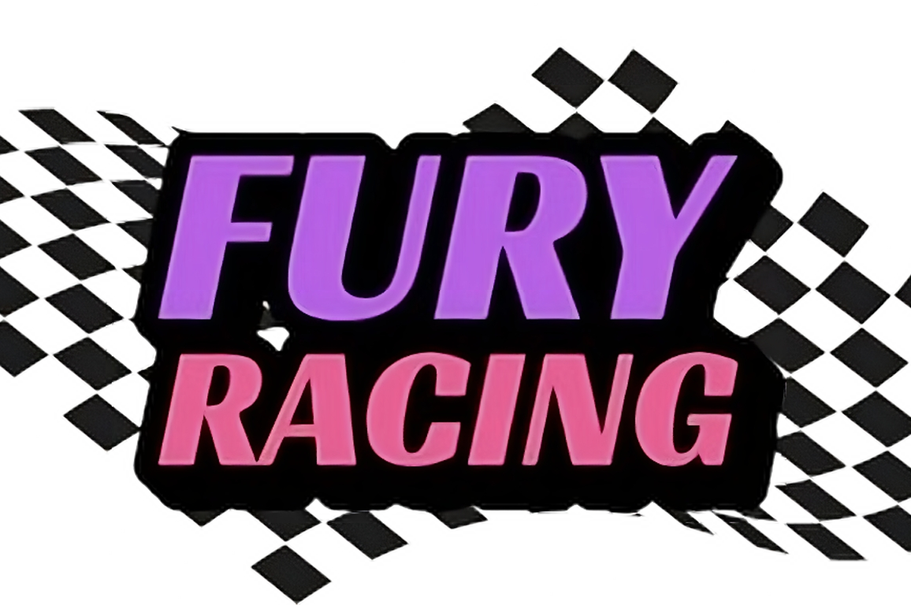

  

<h1><strong> Fury Racing </strong></h1>

 

Try it now on [fury-racing.vercel.app](https://fury-racing.vercel.app/)

 

## Table of Contents

- [Table of Contents](#table-of-contents)
- [Links:](#links)
- [Description:](#description)
  - [Concept:](#concept)
  - [Race Mode:](#race-mode)
- [Installation](#installation)
- [Features:](#features)
- [Inspiration](#inspiration)

## Links:

- [Website](https://fury-racing.vercel.app/)
- [Gitbook documentation](https://fury-racing.gitbook.io/fury-racing)
- [Devpost](https://devpost.com/software/fury-racing)

## Description:

Fury Racing is a **car manager** game (you do not drive the car yourself), based on strategy (about 90%) and a bit of luck (about 10%).

### Concept:

The concept is simple: you must select a car and optimize its attributes to make the best time against another player. The time is automatically calculated based on the selected attributes, the circuit characteristics, and the real-time weather of the circuit's location. This is where all the strategy comes in (See the [backend READM.md](./backend/README.md) for more information about the calculation process).
In addition, a luck mechanism has been introduced to add some spicy to the game. This luck comes from 2 different sources:

1.  Your luck attributes vary depending on how many points you allocate there, as shown in the table below:

| 1   | 2   | 3   | 4   | 5   | 6   | 7   | 8   | 9   | 10  |
| --- | --- | --- | --- | --- | --- | --- | --- | --- | --- |
| -4% | -3% | -2% | -1% | 0%  | +1% | +2% | +3% | +4% | +5% |

So you will get a percentage ranging from +4% to +5% for all other attributes. While it could be tempting to go for the max bonus, keep in mind that the points that you allocate here do not count in your car performance...

2. The second source of luck comes from **Chainlink VRF V2.5**. As soon as the race starts, an additional random percentage ranging from -5% to +5% is also applied to your other attributes!

The 2 luck sources add to each other, giving potential bonuses or malus ranging from -9% to +10% in total! This doesn't make it any less interesting since it won't be enough to reverse the best settings for the race. It does however help "leveling" the field a bit and may push players to play more to try to get lucky!

### Race Mode:

Three different modes have been implemented: **Solo**, **Free**, and **Tournament**.

- **Solo mode**: You play against a computer with randomly generated attributes. You can play for free without waiting and without pressure at any time.
- **Free mode**: You play in a synchronous 1v1. You race for free, but you may have to wait a bit for another opponent to join. You do not have to wait if it takes too long as the race will complete without you as well, but you won't be able to start a new race as long as the previous one hasn't started.
- **Tournament mode**: The gameplay is the same as in Free mode. However, you have to pay a small entry fee to participate. The winner of the race will take all the money, minus 5% that will be added to a weekly prize pool. You also gain points that will allow you to climb the leaderboard. And every 7 days, the leader of the leaderboard wins the prize pool! (The prize pool can be sponsored by anyone to attract more players!)

## Installation

Please refer to each folder's README file for more details as well as information about the installation process and how to run the project locally.

- [Frontend](./frontend/README.md)
- [Backend](./backend/README.md)
- [Contracts](./contracts/README.md)

## Features:

- [x] Car Selection
- [x] Car Customization
- [x] Avalanche Fuji
- [x] Solo mode
- [x] 1v1 Free mode
- [x] 1v1 Tournament mode
- [x] Dark mode support
- [x] Responsive design / PWA
- [x] Sound / Fullscreen support
- [x] Chainlink VRF V2.5
- [x] Chainlink Functions
- [x] Leaderboard
- [ ] 5v5 Tournament mode
- [ ] Add more circuits
- [ ] Add more cars
- [ ] Add more attributes
- [ ] Implement the OpenLAP-Lap-Time-Simulator to make the game even more realistic

## Inspiration

This game is inspired by [GOO-Racing](https://github.com/cairoeth/GOO-Racing) which is itself inspired by the well-known 0xMonaco blockchain contest.
However, while this inspiration gave a starting point, the smart contracts have been entirely revamped and enhanced into a fully operational on-chain game. **Chainlink VRF 2.5** and **Chainlink Functions** have been integrated on top of that to provide additional features. A front-end has been specially built for the occasion to allow any web3 users to interact with the smart contracts in an easy and friendly way. Some animations built with the Babylon.js engine have also been added to make the whole game even cooler!

 

<h2>🎉 Thank you Chainlink for this amazing hackathon! 🎉</h2>
<h3>⭐️ ... and don't forget to leave a star if you like it! ⭐️</h3>

 

(<a href="#top">back to top</a>)

