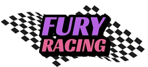

  

<h1><strong> Fury Racing </strong></h1>

  

Try it yourself: [https://fury-racing.vercel.app/](https://fury-racing.vercel.app/)

## Features:

- [x] Avalanche Mainnet
- [x] Car Selection
- [x] Car Customization
- [x] Free mode
- [ ] Tournament mode
- [x] Dark mode support
- [x] Responsive design
- [x] Chainlink VRF
- [x] Chainlink API
- [ ] Leaderboard

  

<h2>🎉 Thank you Chainlink for this amazing hackathon! 🎉</h2>

 

(<a href="#top">back to top</a>)

